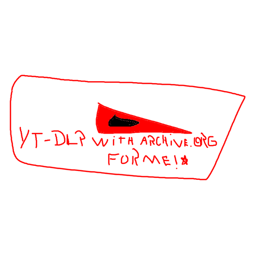

# Mikaguei Downloader

GUI Windows (single-file `.exe`) que envolve **yt-dlp** + **ffmpeg** + **deno** com integração opcional pra subir os vídeos baixados pro **archive.org**.



## Recursos

- Cola URL → "Carregar" mostra:
  - **Vídeo único:** thumbnail grande, título, canal, duração
  - **Playlist:** lista rolável com checkbox + miniatura + título por item; "Marcar/Desmarcar todos"
- Formatos: MP4 melhor qualidade / 1080p / 720p / MP3 320kbps / M4A / Melhor disponível
- Embutir legendas (PT/EN) e thumbnail no arquivo
- **Cookies do YouTube:**
  - Direto do navegador (`--cookies-from-browser chrome|edge|firefox|brave|opera|vivaldi|chromium|safari`)
  - Arquivo `.txt` Netscape (compatível com extensão "Get cookies.txt LOCALLY")
- **Resolução do n-challenge** do YouTube via **Deno embutido** (nada extra pra instalar)
- **Logs persistentes** em `%LOCALAPPDATA%\EasyDownloader\logs\` com timestamp; botões "Abrir log" / "Pasta de logs"
- **Upload pro archive.org** (opcional) com 3 modos:
  - Só baixar (PC)
  - Baixar + enviar pro archive.org (mantém cópia local)
  - Baixar + enviar pro archive.org + apagar local depois do upload
- IA S3 keys salvas em `%LOCALAPPDATA%\EasyDownloader\config.json`, **criptografadas com Windows DPAPI** (CurrentUser scope) — mesmo que alguém copie o config, não consegue ler
- Botão "Esquecer keys salvas" pra limpar credenciais
- **SHA256 do `.exe`** mostrado no log a cada execução pra você comparar com o publicado nas releases

## Download

Pega o `.exe` mais recente em [Releases](../../releases). Cada release tem 3 arquivos:

- **`MikagueiDownloader.exe`** — o executável (~140 MB)
- **`MikagueiDownloader.exe.sha256`** — hash do `.exe` em texto puro
- **`MikagueiDownloader.exe.sigstore.json`** — assinatura Sigstore (keyless OIDC) emitida pelo CI do GitHub Actions desse repo

## Verificar o binário antes de rodar

> O `.exe` **não é assinado por uma CA tradicional** (code signing certificate custa US$200-700/ano e a maioria de projetos open source pequenos não tem). Em vez disso, ofereço duas formas de verificar criptograficamente que o arquivo é genuíno.

### 1. SHA256 (rápido — confirma que o arquivo não foi modificado)

```cmd
certutil -hashfile MikagueiDownloader.exe SHA256
```

Compara com o conteúdo do arquivo `.sha256` baixado da release. Se baterem, o `.exe` é byte-a-byte idêntico ao publicado.

### 2. Sigstore (forte — confirma que o `.exe` saiu desse repo + dessa tag rodando no CI)

Sigstore usa **keyless OIDC**: durante o build, o GitHub Actions assina o `.exe` provando que veio especificamente do workflow `release.yml` desse repo numa tag específica. Não dá pra falsificar mesmo se alguém invadir minha conta — só com acesso ao token efêmero do CI no momento exato do build.

```bash
pip install sigstore

python -m sigstore verify github \
  --cert-identity "https://github.com/ZakiSCzip/Mikaguei-Downloader/.github/workflows/release.yml@refs/tags/v1.6.2" \
  --bundle MikagueiDownloader.exe.sigstore.json \
  MikagueiDownloader.exe
```

Saída esperada: `OK: MikagueiDownloader.exe`. Troca `v1.6.2` pela tag que baixou.

### 3. SHA256 mostrado pelo próprio app

Ao iniciar, o app calcula o próprio SHA256 e imprime no log (`[info] SHA256 do .exe: <hex>`). Compara com o `.sha256` do GitHub. Se baterem, o que está rodando na sua máquina é exatamente o que o CI gerou.

## SmartScreen / Antivírus

Como o `.exe` não tem code signing certificate tradicional, o Windows pode mostrar o aviso **"O Windows protegeu o seu PC"** na primeira execução. Faz assim:

1. Verifica o SHA256 (passo 1 acima) — se bater com o publicado, o arquivo é o oficial
2. Clica em **"Mais informações"** → **"Executar assim mesmo"**

Se o antivírus marcar como ameaça, é falso-positivo comum em binários PyInstaller (yt-dlp.exe oficial e muitos outros sofrem do mesmo problema). Você pode adicionar à lista de exceções depois de verificar a assinatura Sigstore.

## Como usar

1. Abre o `.exe` (Windows pode pedir "Mais informações" → "Executar assim mesmo" porque não é assinado)
2. Cola URL → **Carregar**
3. Marca os itens que quer baixar (em playlist) e o formato
4. (Opcional) **Cookies:** se for YouTube, marca *Do navegador* e seleciona seu navegador (precisa estar fechado), ou *Arquivo (.txt)* exportado de uma extensão tipo "Get cookies.txt LOCALLY"
5. (Opcional) **Destino:** se quiser publicar no archive.org, marca a opção, cola Access/Secret keys de https://archive.org/account/s3.php
6. **Baixar selecionados**

## Build local

Linux com Docker (cross-compile pra Windows usando Wine):

```bash
# Coloca os binários em bin/ (não vão pro git):
#   bin/yt-dlp.exe       (de https://github.com/yt-dlp/yt-dlp/releases)
#   bin/ffmpeg.exe       (de https://www.gyan.dev/ffmpeg/builds/)
#   bin/ffprobe.exe
#   bin/deno.exe         (de https://github.com/denoland/deno/releases)

docker run --rm -v "$(pwd):/src/" cdrx/pyinstaller-windows:python3 \
    "pip install -r requirements.txt && \
     pyinstaller --clean -y --distpath ./dist --workpath ./build/work \
                 build/mikaguei_downloader.spec"
```

O `.exe` final fica em `dist/MikagueiDownloader.exe` (~140 MB).

Windows nativo:

```powershell
pip install -r requirements.txt pyinstaller
pyinstaller --clean -y --distpath .\dist --workpath .\build\work `
            build\mikaguei_downloader.spec
```

## Como funciona o release automático

A cada `git tag v*` empurrada, o workflow `.github/workflows/release.yml` roda em `windows-latest`, baixa **yt-dlp** / **ffmpeg** / **deno** das releases oficiais (links pinados no workflow), builda com PyInstaller, calcula SHA256, e publica o `.exe` + `.sha256` numa **GitHub Release**. O hash do `.exe` aparece no log da app a cada execução e é exatamente o publicado na release — qualquer pessoa pode auditar.

## Componentes embutidos

- **yt-dlp** (Unlicense / Public Domain): https://github.com/yt-dlp/yt-dlp
- **ffmpeg / ffprobe** (essentials build, LGPL): https://www.gyan.dev/ffmpeg/builds/
- **Deno** (MIT): https://deno.land/

## Privacidade

- Nenhuma telemetria. O app **não** chama nenhum servidor externo a não ser:
  - O site de origem do vídeo (yt-dlp via TLS)
  - `s3.us.archive.org` quando você pediu upload pro archive.org (TLS)
- Cookies (do navegador ou do `.txt`) são passados direto pro yt-dlp como argumento; o app **não** lê, salva ou transmite esses cookies.
- IA keys salvas no config são criptografadas com DPAPI (CurrentUser scope no Windows).

## Licença

MIT — ver [LICENSE](LICENSE).
